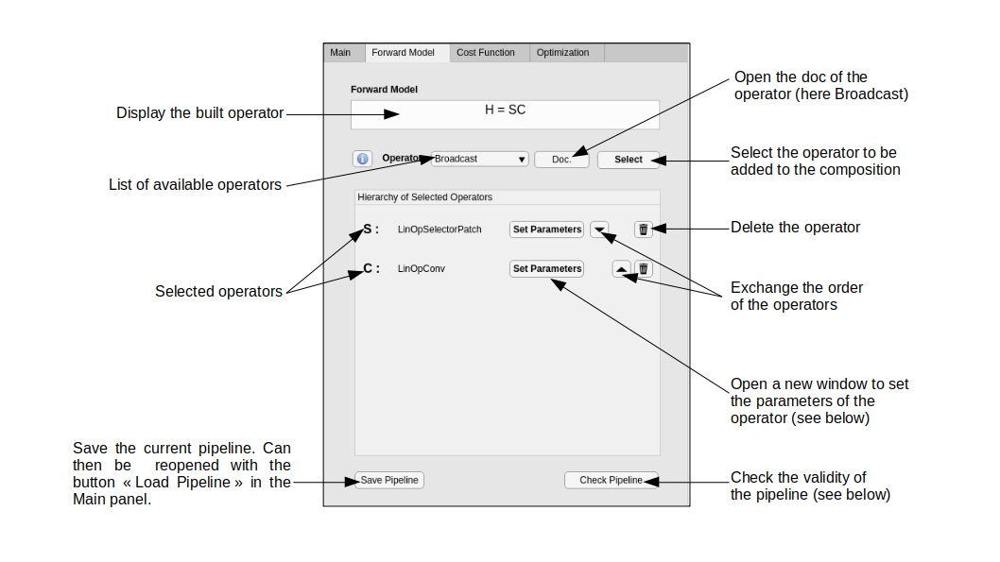
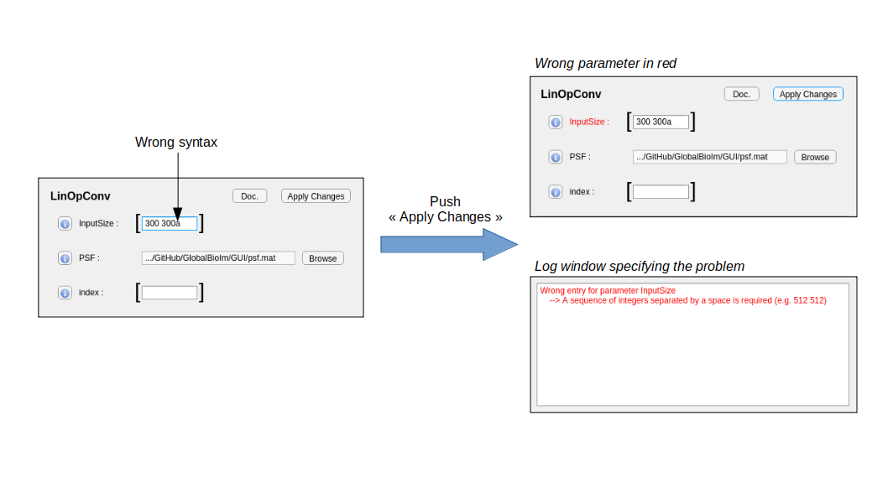
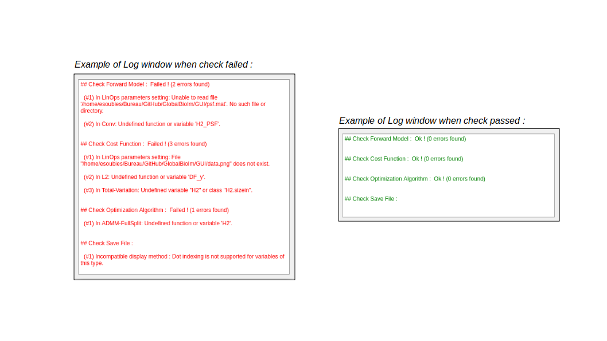

Graphical User Interface (GUI)
******************************

GlobalBioIm is ditributed together with a user-friendly Matlab interface that allows
to intuitively build tailored reconstruction algorithms with minimal effort. 

To use it, run the **GUI_GlobalBioIm.mlapp** file in the **GUI/** folder of the library.

Demo Video
----------

*This is a temporary explanatory video on how to use the GUI of GlobalBioIm on a concrete example (i.e. multi-channel deconvolution). A more concise, better-quality video is in preparation and will come out soon.*

.. youtube:: https://www.youtube.com/watch?time_continue=8&v=kWQj2Z0K5yc&feature=emb_logo

Panels Description
------------------

The GUI is composed of four panels that are described in the following sections.

Main Panel
..........

The Main panel allows to create a new pipeline or to load an existing one. It also contains a description field that can be edited to provide information about the pipeline.

.. figure:: DocGUI-1.png
   :scale: 65%
   :alt: Main Panel
   :align: center

Forward-Model Panel
...................

This panel offers the possibility to create a forward model by composing elementary operators. Here, operators can be added, removed, or interchanged within the composition. Moreover, each operator comes with its own parameters that can be set by pushing the :class:`Set Parameters` button. Finally, the validity of the generated forward model can be checked through the button :class:`Check Pipeline`.

Cost Function Panel
...................

This panel provides tools to build a cost function formed out of the sum of a data-fidelity term and a regularization term. Its use is similar to the use of the Forward Model panel.

.. figure:: DocGUI-3.png
   :scale: 65%
   :alt: Cost Function Panel
   :align: center

Optimization Panel
..................

Last, but not least, the Optimization panel allows to select an algorithm to minimize the built cost function. The proficiency of the GlobalBioIm GUI is to propose **only** algorithms that are **adapted** to the built cost function. This specific list of algorithms can be easily obtained by clicking on the button :class:`Refresh Algorithm List`.  Then, once an algorithm has been selected, its parameters can be set using the :class:`Set Parameters` button. Finally, the Optimization panel offers the possibility to set some general parameters (*e.g.* display mode, GPU option) and to **RUN** or **Generate** (and save) the Matlab script that is associated to the pipeline.

.. figure:: DocGUI-4.png
   :scale: 65%
   :alt: Optimization Panel
   :align: center

.. note::
	For some algorithms (e.g. ADMM) there exists a variety of possible instanciation which depend, for instance, on the splitting strategy. For such algorithms, the GlobalBioIm GUI proposes a couple of instanciations that may not be the optimal ones. However, it tries as much as possible to propose instantiations that do not require nested iterates.

Dialog Boxes
-------------

In addition to the four panels, the graphical interface can open (dynamically) additional windows.

Set Parameters Window
.....................

Each selected operator, data-fidelity, regularizer, or algorithm comes with its own :class:`Set Parameters` button. When pushed, 
a new window opens and displays the list of parameters of the object. The user can then set/modify those parameters. Two examples
with a variety of types of parameters are presented below.

.. figure:: DocGUI-5.png
   :scale: 65%
   :alt: Set Parameters Window
   :align: center

When the button :class:`Apply Changes` is pushed, the syntax of the parameters is checked. If everything is correct, the *Set Parameters* window is closed and the parameters are saved. Otherwise a *Log* window opens as illustrated in the following example.

.. note::
   *Set Parameters* windows can only be closed through the associated :class:`Apply Changes` button.

Log Window (Check Pipeline)
...........................

Whenever the buttons :class:`Check Pipeline` or :class:`RUN` are pushed, the complete script (automatically generated) is checked. If errors are detected, a *Log* window opens with the list of errors. If no error, the script is run (when the :class:`RUN` button is pushed) or a *Log* window indicating no error opens (when the :class:`Check Pipeline` is pushed).

.. important::
   The errors reported in the *Log* window must be treated in the order they appear. Frequently, a cascade of errors is reported and they can all be resolved by fixing the very first one. In the above example, all the errors are due to wrong paths to the psf (error #1 of foward model) and data (error #1 of cost function) files. Updating these two paths fix all the errors.

   **Good practice:** Fix the very first error and then check the pipeline again. Repeat this as long as there are errors.

Recap Parameters Window
.......................

In order to avoid opening all the *Set Parameters* windows when a user wants to change the parameters of a loaded pipeline, the GlobalBioIm GUI has a :class:`Recap of Selected Parameters` button. It opens a window that gathers all the parameters of the selected operators, data-fidelity, regularizers, and algorithms. If the *discard default parameters* option is activated, the parameters that have been let to their default value will not appear in the *Recap* window (see below). 

.. figure:: DocGUI-8.png
   :scale: 65%
   :alt: Log Window
   :align: center
